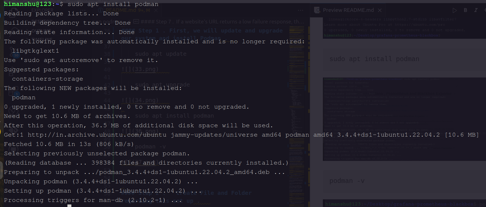
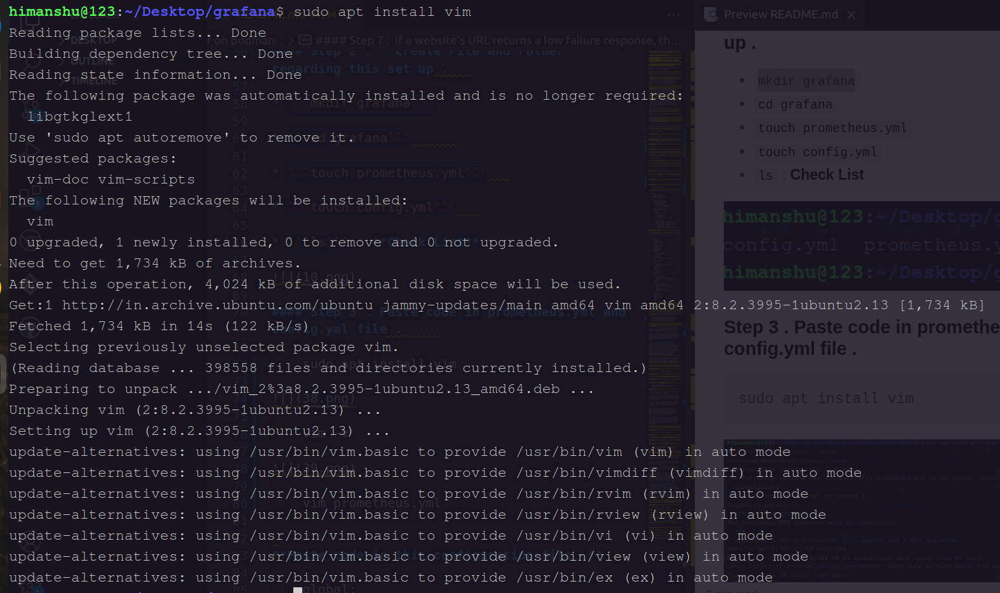
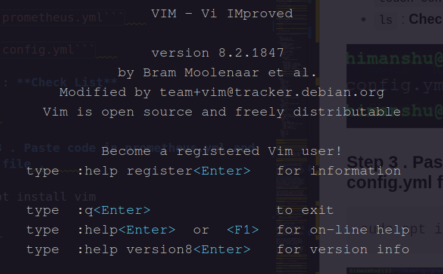
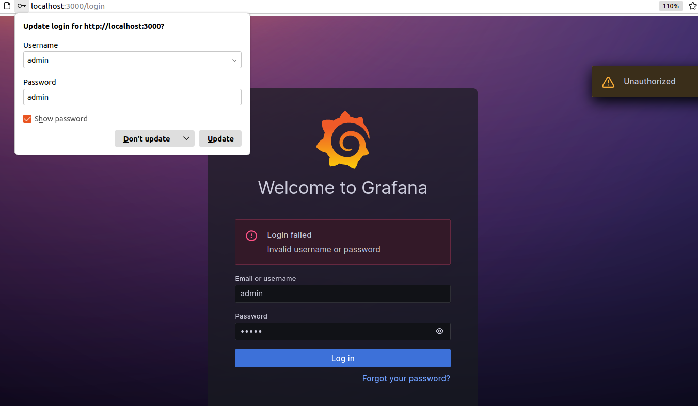
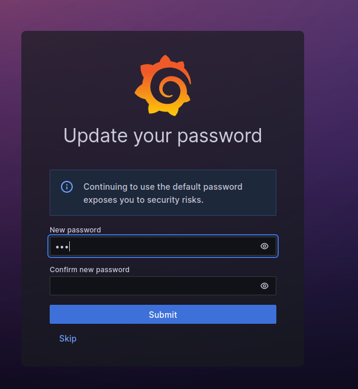
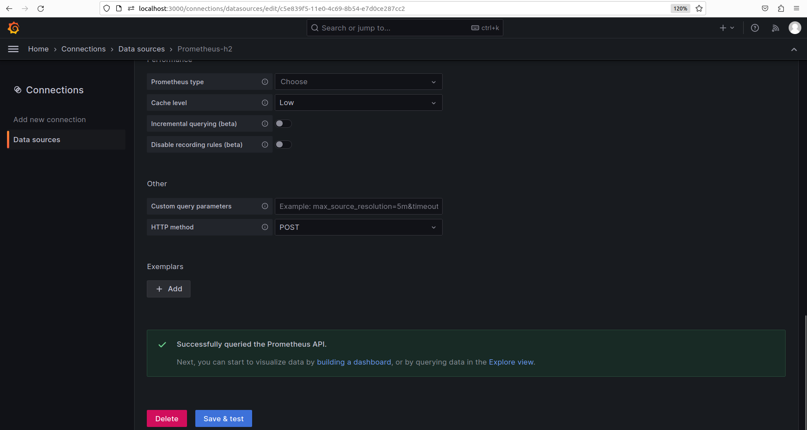
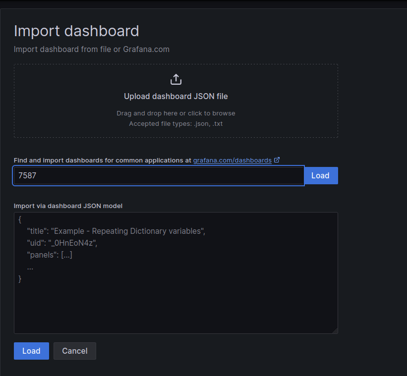
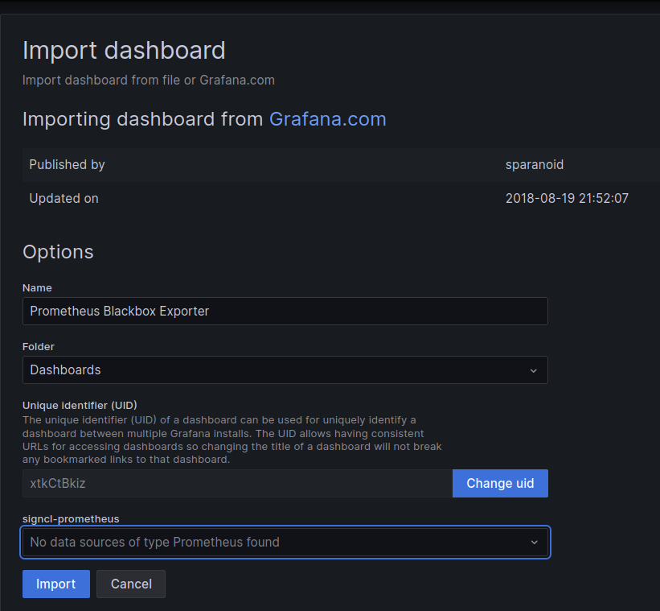
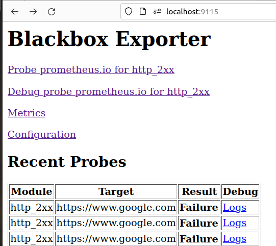

# <center><u>Set up Grafana , Prometheus and Blackbox Exporter </u></center>    

##### <u>Table of Content </u>  

[1 - Definition of Grafana , Prometheus and Blackbox Exporter](#1-definition-of-grafana--prometheus-and-blackbox-exporter)   

[2 - How to set up Grafana , Prometheus and Blackbox Exporter on Podman Container ?
](#2-how-to-set-up-grafana--prometheus-and-blackbox-exporter-on-podman-container)  


### 1. Definition of Grafana , Prometheus  and Blackbox Exporter 


**<center>a. Grafana**: Grafana is an open-source analytics and monitoring platform that integrates with various data sources, allowing users to visualize and understand metrics through customizable dashboards.</center>


**<center>b. Prometheus:** Prometheus is an open-source monitoring and alerting toolkit designed for reliability and scalability. It collects and stores time-series data, offering powerful querying and alerting capabilities.</center>   


 **<center>c. Blackbox Exporter:** Blackbox Exporter is a Prometheus exporter designed for probing and monitoring external services. It allows users to check the availability and response of endpoints, such as HTTP, TCP, ICMP, and DNS, and generates metrics based on the results.</center>


### 2. How to set up Grafana , Prometheus and Blackbox Exporter on Podman Container ?   


#### **System Requirement**  

* **Distributor ID:	Ubuntu**
  **Description:	Ubuntu 22.04.3 LTS**
  **Release:	22.04**
  **Codename:	jammy**     

* **podman version 3.4.4**  


#### Step 1 . First, we will update and upgrade our system and install Podman .   

    sudo apt update    
```
Preview README.
libmagickcore-6-h
Learn more about Ub
O upgraded, newi
himanshu@1231-/Deak
Hit:1 http://in.archive.ubuntu.com/ubuntu jammy InReleaserns a low failure response, th... Get:3 http://in.archive.ubuntu.com/ubuntu jammy-updates InRelease [119 kB]
Get:4 http://security.ubuntu.com/ubuntu jammy-security InRelease [110 kB]
Hit:2 https://packages.cloud.google.com/apt kubernetes-xenial InRelease
Hit:5 http://in.archive.ubuntu.com/ubuntu jammy-backports InRelease
sudo apt i
Get:6 http://in.archive.ubuntu.com/ubuntu jammy-proposed InRelease [270 kB]
Get:7 http://in.archive.ubuntu.com/ubuntu jammy-proposed/universe amd64 Packages [59.7 kB]
Get:8 http://in.archive.ubuntu.com/ubuntu jammy-proposed/universe 1386 Packages [29.6 kB]
Get:9 http://in.archive.ubuntu.com/ubuntu jammy-proposed/universe Translation-en [26.8 kB]
Get:10 http://in.archive.ubuntu.com/ubuntu jammy-proposed/main amd64 Packages [212 kB]
Get:11 http://in.archive.ubuntu.com/ubuntu jammy-proposed/main i386 Packages [53.1 kB]
Get:12 http://in.archive.ubuntu.com/ubuntu jammy-proposed/main Translation-en [46.0 kB] Fetched 926 kB in 4s (224 kB/s)36.png)
Reading package lists... Done
Building dependency tree... Done
podman - v
Reading state information... Done 37.png)
All packages are up to date.
```

* **sudo:** This part of the command gives you temporary administrative privileges. It stands for "superuser do." It allows you to execute commands that require special permissions, like updating software.

* **apt:** This stands for "Advanced Package Tool." It's a package management system used in many Linux distributions, including Ubuntu and Debian. It helps you install, update, and remove software on your system.

* **update:** This is the action you're telling APT to perform. When you run sudo apt update, you're asking the system to update its list of available software packages. It checks the internet for any updates to the packages installed on your system and retrieves this information.      

* **System Upgrade**

```
sudo apt upgrade 
```

```
Reading package lists... Done
Building dependency treen.pod Done #### Step 7. If a website's URL returns a low failure response, th...
Reading state information... Done Step 1. First, we will update and upgrade Calculating upgrade... Done our system and install Podman
The following package was automatically installed and is no longer required:
libgtkglext1
39
Use 'sudo apt autoremove' to remove it.
Get more security updates through Ubuntu Pro with 'esm-apps' enabled:
libmagickcore-6.q16-dev python2.7-minimal libmagickwand-dev imagemagick
libopenexr-dev libopenexr25 libpostproc55 libmagickcore-dev
libmagickcore-6.q16-6-extra libavcodec58 libmagickwand-6.q16-6 libpython2.7
libavutil56 imagemagick-6.q16 libswscale5 libmagickcore-6.q16-6
libswresample3 imagemagick-6-common libmagickcore-6-arch-config ruby-rack
libavformat58 python2.7-dev libpython2.7-dev libmagickwand-6-headers
python2.7 libpython2.7-minimal libmagickwand-6.q16-dev
libmagickcore-6-headers libpython2.7-stdlib libavfilter7
Learn more about Ubuntu Pro at https://ubuntu.com/pro
0 upgraded, 0 newly installed, 0 to remove and 0 not upgraded.
```


* **sudo:** This stands for "superuser do" and it's a way to tell the system that you want to perform the following command with administrator privileges. In other words, you're asking for permission to make changes to your system, and it's usually used for tasks that require special permissions.

* **apt:** This is a package manager for Debian-based Linux distributions like Ubuntu. It's a tool that helps you install, update, and manage software packages on your computer. You can think of it as a way to easily install and update programs.

* **upgrade:** This is the action you're telling apt to perform. When you run sudo apt upgrade, you're instructing the package manager to check for updates for all the software packages currently installed on your system.

* **Install Podman** 

```

sudo apt install podman 
```

    

* **sudo:** This is a command that stands for "superuser do." It's used to execute the following command with administrative privileges. In other words, it allows you to make system-wide changes and install software.

* **apt:** This is a package manager for Debian-based Linux distributions like Ubuntu. It's a tool for managing software packages, including installation, updates, and removal.

* **install:** This is the action you want to perform with apt. You're telling it to install a software package.

* **podman:** This is the name of the software package you want to install. Podman is a container management tool, similar to Docker, which allows you to run and manage containers on your system.

* **Check Version**

```

podman -v
```
```

podman version 3.4.4
```

* **Podman:** This is the name of the software or program you are using.

* **-v:** This is an option or flag that you add to the command to tell Podman to show you the version information.


#### Step 2 .   Create File and Folder regarding this set up .   

* ```cd Desktop```

* ```mkdir grafana```

* ```cd grafana```      

* ```touch prometheus.yml```   

* ```touch config.yml```   

* ```ls``` : **Check List**  

```

himanshu@123:~/Desktop/grafana$ ls
config.yml prometheus.yml
```

#### Step 3 . Paste code in prometheus.yml and config.yml file .     

```
sudo apt install vim
```




* **sudo:** This part of the command is used to run the following command with superuser privileges. It allows you to make system-wide changes, which are usually restricted to the system administrator.

* **apt:** This is a package manager used in Debian-based Linux distributions like Ubuntu. It helps you install, update, and manage software on your computer.

* **install:** This is the action you want to perform with apt. You're telling apt to install a software package.

* **vim:** This is the name of the software package you want to install. Vim is a popular text editor that's often used in the command line.

* **Check Version**

```
vim -v
```

      


* **Vim:** Vim is a powerful and popular text editor that you can use to create and edit text files, code, and various types of documents.

* **-v:** This is an option or flag that you pass to the Vim command. In this context, it's used to tell Vim to display its version information.

* **Write Prometheus File** 

```
vim prometheus.yml
```       

When you open a **prometheus.yml** file in Vim, you need to first press **"i" (insert**) to start editing. Then you should enter the following code. After making the necessary changes according to your coding, you should press **"Esc" (escape)** and then type **":wq!" (write and quit forcefully)** to save the file and exit it. This will save your file and close it.


**Paste code in this configuration file .**  

    global:
      scrape_interval: 15s
      scrape_timeout: 10s
      evaluation_interval: 15s

    scrape_configs:
      - job_name: 'prometheus'
        scrape_interval: 5s
        static_configs:
          - targets: ['192.168.1.113:9090', '192.168.1.113:9115']

      - job_name: 'blackbox'
        metrics_path: /probe
        params:
          module: [http_2xx]

        static_configs:
          - targets:
            - https://www.google.com  

        relabel_configs:
          - source_labels: [__address__]
            target_label: __param_target
          - source_labels: [__param_target]
            target_label: instance
          - target_label: __address__
            replacement: 192.168.1.113:9115  


```
hostname -I
```
```
192.168.1.8 172.17.0.1
```


* **starting ip**

You need to add the hostname and IP address in your Prometheus.yml file, and you can choose any URL for monitoring. I have monitored  on **Google's website**. You can choose any URL according to your preference.   
https://www.google.com


* **Write Configuration File**

```  
vim config.yml    
```

When you open a **config.yml** file in Vim, you need to first press **"i" (insert**) to start editing. Then you should enter the following code. After making the necessary changes according to your coding, you should press **"Esc" (escape)** and then type **":wq!" (write and quit forcefully)** to save the file and exit it. This will save your file and close it.


**Paste code in this configuration file .**  

    modules:
      http_2xx:
        prober: http
      http_post_2xx:
        prober: http
        http:
          method: POST
      tcp_connect:
        prober: tcp
      pop3s_banner:
        prober: tcp
        tcp:
          query_response:
          - expect: "^+OK"
          tls: true
          tls_config:
            insecure_skip_verify: false
      grpc:
        prober: grpc
        grpc:
          tls: true
          preferred_ip_protocol: "ip4"
      grpc_plain:
        prober: grpc
        grpc:
          tls: false
          service: "service1"
      ssh_banner:
        prober: tcp
        tcp:
          query_response:
          - expect: "^SSH-2.0-"
          - send: "SSH-2.0-blackbox-ssh-check"
      irc_banner:
        prober: tcp
        tcp:
          query_response:
          - send: "NICK prober"
          - send: "USER prober prober prober :prober"
          - expect: "PING :([^ ]+)"
            send: "PONG ${1}"
          - expect: "^:[^ ]+ 001"
      icmp:
        prober: icmp
      icmp_ttl5:
        prober: icmp
        timeout: 5s
        icmp:
          ttl: 5      


#### Step 4 .  Run the container Prometheus on podman .    

```
podman run -d -p 9090:9090 -v /home/himanshu/Desktop/grafana/prometheus.yml:/etc/prometheus/prometheus.yml --name prometheus-container prom/prometheus
```

* **podman run:** This is the command to run a container using Podman, which is an alternative to Docker for managing containers.

* **-d:** This flag indicates that you want to run the container in detached mode, meaning it will run in the background.

* **-p 9090:9090:** Which one is the host port and which one is the container port? - In the command -p 9090:9090, the **first** 9090 represents the host port, and the **second** 9090 represents the container port. This means that traffic sent to port 9090 on the host will be forwarded to port 9090 inside the container.


* **-v /home/himanshu/Desktop/grafana/prometheus.yml:/etc/prometheus/prometheus.yml:** This flag is used to create a volume mount. It maps the local file /home/himanshu/Desktop/grafana/prometheus.yml to the container's path /etc/prometheus/prometheus.yml. This is a common practice for providing configuration files to a container.

* **--name prometheus-container:** This flag assigns a name to the container. In this case, the container is named "prometheus-container."

* **prom/prometheus:** This is the Docker image you want to run. It appears to be the official Prometheus Docker image, which is used to run the Prometheus monitoring system.

* ```podman images``` : check images .   

   

* ```podman ps``` : check container .  

   

* show on Localhost : http://localhost:9090/targets?search=   


In the context of Prometheus, **"targets"** typically refer to the services or endpoints that Prometheus scrapes data from. The URL **"localhost:9090"** is often used to access the Prometheus web interface. It's possible that the targets you are trying to access are not configured properly in your Prometheus instance.


       

If your container is **down**, the first thing you need to do is run the commands for Blackbox Exporter and Grafana, which will bring your container back **up**.

### Step 5 .  Run the container Blackbox Exporter on podman  .    

```
podman run -d --name black -p 9115:9115  bitnami/blackbox-exporter:latest     
```


* **podman run:** This is the basic command for running a container with Podman.

* **-d:** This flag stands for "detached" mode, which means that the container will run in the background, and you'll get your terminal prompt back immediately.

* **--name black:** This flag assigns a name "black" to the running container, allowing you to easily reference it by name instead of a container ID.

* **-p 9115:9115:** This flag maps ports between the host and the container. In this case, it's mapping port 9115 on the host to port 9115 in the container. This is useful if the container is running a service that you want to access from your host machine.

* **bitnami/blackbox-exporter:latest:** This is the name of the Docker image that you want to run as a container. It's specifying the image "bitnami/blackbox-exporter" with the "latest" tag, meaning the latest available version of that image.


* ```podman images``` : check images .   

  

* ```podman ps``` : check container .  

  

* show on Localhost : http://localhost:9115  

  

#### Step 6 .  Run the container Grafana on podman  .

```
podman run -d --name grafana -p 3000:3000 -e "GF_SECURITY_ADMIN_PASSWORD=keenable" grafana/grafana    
```

* **podman run:** This is the command to run a container using Podman, a containerization tool similar to Docker.

* **-d:** This flag stands for "detached" mode, which means that the container will run in the background as a daemon.

* **--name grafana:** This flag assigns a name to the container, in this case, "grafana." This name can be used to reference and manage the container.

* **-p 3000:3000**: This flag is used to map ports between the host machine and the container. It specifies that port 3000 on the host should be mapped to port 3000 inside the Grafana container. This is important for accessing Grafana's web interface, as the Grafana server runs on port 3000 by default.

* **-e "GF_SECURITY_ADMIN_PASSWORD=keenable":** This flag is used to set an environment variable within the container. In this case, it's setting the Grafana admin user's password to "admin." This is a common initial setup step to secure your Grafana instance.

* **grafana/grafana:** This is the name of the Docker image that you want to run. It specifies that you want to run the official Grafana Docker image from the "grafana" repository on Docker Hub.   


* ```podman images``` : check images .   

  

* ```podman restart <container id>```: **Restart all container**

* ```podman ps``` : check container .  

  

* show on Localhost : http://localhost:3000    


If we enter the ID and password as **'admin admin'**, Grafana will not open.




* As soon as I entered the **username 'admin' and the password 'keenable,'** my Grafana opened.





After opening Grafana, the first thing you need to do is add a data source for Prometheus.

  

In order to configure Prometheus, you will need to add the following **URL: http://Hostname starting IP:9090**, which should include the **port and hostname** of your Prometheus.




After adding the data source, you will need to **import** a dashboard. To do that, you need to enter the **Grafana dashboard IP as 7587**. When you enter the dashboard IP and add the Prometheus data source, your dashboard will open.





**As soon as you import it, your Grafana dashboard will open.**

 

    

#### Step 7 .  If a website's URL returns a low failure response, then in this situation, the dashboard will be down.  

* **Blackbox Exporter**  

   

* **Prometheus** 


* **Grafana**   


